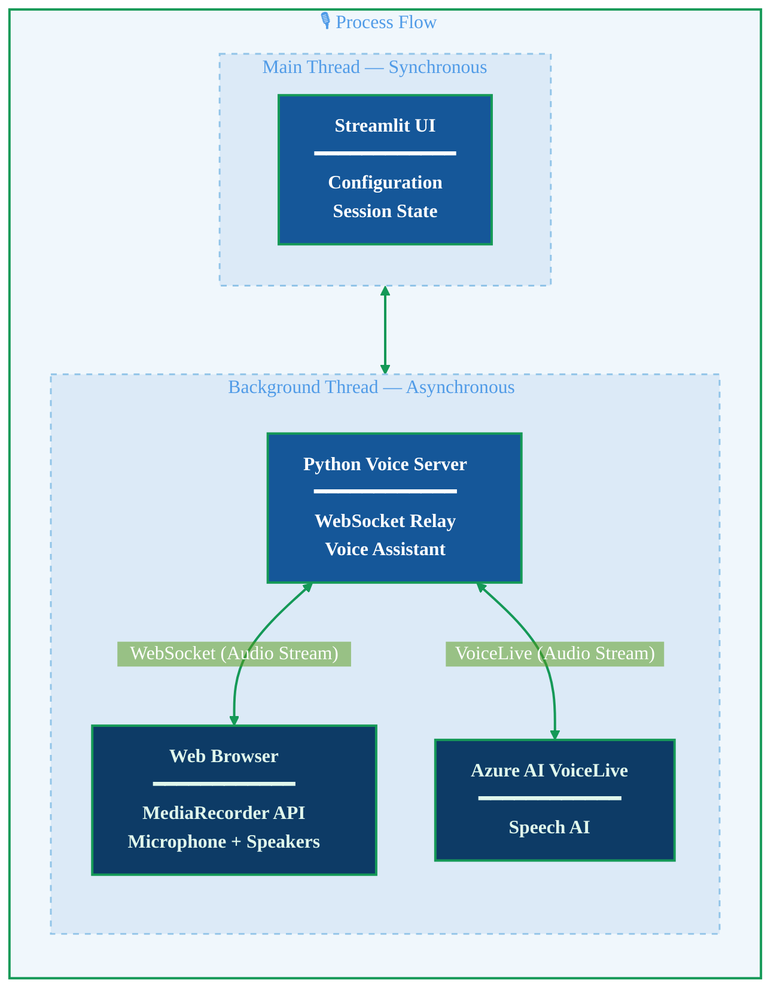




_Figure: AI generated illustration of article's title._

---
**[{{ site.title }}]({{ site.url }})** | By {{ page.author | default: "Aurora Voje" }} | {{ page.date | date: "%B %d, %Y" }}

---

This is Part 1 of the **Speaking in Code series** on building real-time voice-first AI agents with Python and Azure:

1. 🎙️ Bringing a Voice AI Agent to Your Browser — concepts, architecture and code samples
2. 🐍 The Python Behind the Voice — Azure VoiceLive SDK implementation deep-dive
3. ☁️ From Localhost to Cloud — deployment architecture

* TOC
{:toc}

# Introduction

The next frontier of generative AI isn't just about smarter text — it's about **voice**. 
While chat interfaces have transformed how we interact with AI, they still require a 
screen, a keyboard, and the ability to type. Not everyone has that luxury. For people 
with visual or motor impairments, for someone cooking dinner with flour-covered hands, 
or for a driver navigating traffic — voice is the most natural and accessible interface 
there is.

But how does voice AI work? This curiosity-based question led me into the exploration which I want to share with you!
About a decade ago I took courses covering audio and 
music generation with machine learning, but I had never built a project around real-time 
speech AI, and AI agents weren't exactly around 10 years ago. I wanted to understand how the pieces fit together: How does audio 
travel from a browser microphone to an AI model and back? What does it take to make that 
feel like a real conversation?

The result is a real-time voice AI agent built with 
[Azure VoiceLive SDK](https://learn.microsoft.com/en-us/azure/ai-services/speech-service/voice-live-overview) 
and [Streamlit](https://streamlit.io/). This isn't a simple 
speech-to-text-to-speech wrapper — it's a conversational system with natural turn-taking, 
interruption handling, and browser-based audio streaming that works on any device.

In this post I'll focus on the **building blocks**: what components are needed, 
why they're needed, and how they work together. We'll use analogies and simplified code 
samples to build intuition before diving into the real implementation in upcoming posts.

**On the State of Voice AI**

The future of AI interaction is happening right now, and it sounds a lot more natural 
than you might think. While text-based chat interfaces have dominated the AI landscape, 
we're entering an era where voice-first experiences are becoming not just possible, but 
practical.

The largest cloud enterprise providers like Microsoft Azure, Amazon Web Services (AWS) and Google Cloud have advanced significantly in AI agent development and in voice-enabling AI agents. Microsoft Azure VoiceLive was chosen for this project because of its mature, unified speech-to-speech API and Python SDK. Azure's current lead is in the unified approach: one API, one connection, one SDK. This is a significant advantage for achieving stable results quickly. However, the enterprise competitors [AWS Nova Sonic](https://aws.amazon.com/blogs/aws/introducing-amazon-nova-sonic-human-like-voice-conversations-for-generative-ai-applications/) and [Google Cloud's Dialogflow CX](https://docs.cloud.google.com/dialogflow/cx/docs) offer strong alternatives with different trade-offs, and this field is evolving rapidly.


**Why voice matters**

Voice AI represents a fundamental shift in how we interact with intelligent systems. 
Consider the advantages over text-based interfaces:

| Advantage | Why it matters |
|---|---|
| **Speed** | Voice input is ~4× faster than typing — 150 words/min vs. 40 words/min |
| **Hands-free operation** | Use AI while cooking, driving, or working with your hands |
| **Natural interface** | We've been speaking for ~50,000 years, typing for ~150 |
| **Accessibility** | Removes barriers for users with visual or motor impairments |
| **Emotional context** | Tone, emphasis, and pacing convey meaning that text simply cannot |

**What does "voice-first" mean?**

Traditional voice-enabled applications follow a sequential pipeline:


_ASR = Automatic Speech Recognition (speech-to-text) · TTS = Text-to-Speech_

There's latency at every step, and the conversation feels robotic. In voice-first
architectures, these same steps still exist — but they're overlapped and continuous,
not strictly sequential and blocking.

Voice-first design means the experience is built around continuous, low-latency audio
as the primary interface, not as a bolt-on to a text or screen workflow. All key tasks
can be completed via voice alone, with any visual UI being supplementary, not required.
Modern real-time voice models enable:

- Sub-second response times — conversation feels natural, with minimal pauses
- Interruption handling — you can talk over the AI, and it adapts mid-sentence.
- Turn detection — the system infers when you've finished speaking, without fixed wake words or buttons.
- Bidirectional streaming — audio flows continuously in both directions in real time.

By the end of this post, you'll understand:

- What building blocks are needed to bring a voice AI agent to the browser — threading, async functions, event loops, WebSockets, and the Azure VoiceLive SDK.
- Why each component is necessary — through analogies and simplified Python code samples.
- How the voice data flows — from browser microphone, through the Python voice server, to Azure VoiceLive, and back to the speakers.
- How the components work together — to establish and maintain a smooth, real-time conversation between a human and an AI agent.

In later posts we'll dive into the code implementation and deployment architecture.
For now — let's build the foundation. 🎤👩‍💻🤖


* * *


# The application demo 

Let's start looking at the application user interface (app UI) to get a visual understanding of the UI components.
For demonstration purposes, the app is very simple; it has a main panel with instructions, a "Start voice server" button, and a sidebar panel where one can choose one of the eight standard Azure provided voices. It is also possible to create your own voice, but that is not in the scope
of this article. One can also add specified agent instruction by clicking on the "Custom Instructions" button. Here you can 
steer the agent toward the kind of conversation you wish to have.

When the "Start voice server" button is clicked, the Python server starts in the app's background thread, which establishes a 
connection to Azure's Speech AI VoiceLive module by connecting to it via a WebSocket. More details on what all this is and how it works will be
discussed in the sections below.

If the connection is successful, two new buttons appear; "Start Conversation" and "Stop". By clicking the "Start Conversation" button,
you can start talking to the agent. There is also a tab "Debug Info", showing the potential errors and/or warnings, or if everything is
working as it should. There is also a button "Reset Server State" in case we want to reset. If you want to stop the conversation, you click the "Stop" button.


<div class="main-carousel" data-flickity='{ "cellAlign": "left", "contain": true, "wrapAround": true }'>
  
  <div class="carousel-cell">
    
    <p>1. Voice app - main panel and sidebar</p>
  </div>

  <div class="carousel-cell">
    
    <p>2. Voice app - select agent voice in sidebar</p>
  </div>

  <div class="carousel-cell">
    
    <p>3. Voice app - add custom instructions in sidebar </p>
  </div>

  <div class="carousel-cell">
    
    <p>4. Voice app - run voice server and start conversation </p>
  </div>

</div>

Here is a video demonstrating a conversation with the voice agent. 
Can you hear what potential improvements and adjustments the default SDK settings could use?

<video width="100%" controls>
  <source src="{{ site.baseurl }}/assets/videos/2026-02-09-ai-agents-voice/ai_voice_stream_andrew_cropped.mp4" type="video/mp4">
  Your browser does not support the video tag.
</video>

* * *

# Architecture overview

Quick note: this post covers the local architecture — enough to get the app running on your machine. The full deployment story gets its own post.

A voice-first application requires coordinating several moving parts: browser audio APIs, WebSocket connections, multiple process threads, event loops, 
Azure VoiceLive SDK for speech AI, and the application UI. Getting this architecture right is crucial for a responsive and reliable experience.

**High-level system architecture**

Since we want the sound to work in a web app run in a web browser, we need to set up a web based voice process flow.
Let's first walk through the process flow diagram, then dig into each component and why it's there.


_Figure: High level architecture of the application with real-time voice AI process flow._


The main steps of this process flow are:

- The streamlit application starts in the **main Python thread** and the user has several buttons available to click. All user-application interactions are **synchronous tasks**: 
    - Start python voice server, 
    - Choose a voice for the agent, 
    - Add agent instructions on text input. 
  
- When the Python voice server button is clicked, it creates a **Python background thread with asynchronous tasks**. These establish bidirectional communication between the app and the web browser's media components via a WebSocket relay module, and between the app and Azure AI via a Voice Assistant module utilizing the Azure VoiceLive SDK. The asynchronous tasks are coordinated by an **event loop**.
- When the bidirectional connection between Python, web browser and Azure is ready, we have the following voice data flow with **asynchronous tasks**:    
    - **Browser captures audio**: When the user starts speaking, the browser JavaScript native Web Audio API (ScriptProcessor) accesses the device's microphone and captures real-time audio samples in PCM16 format (24kHz, mono).
    - **WebSocket Transport**: The audio stream is sent in real-time from the browser to the Python voice server. The WebSocket maintains an open connection for instant bidirectional communication, eliminating the overhead of establishing new HTTPS connections for each message.
    - **WebSocket Relay (Browser → Azure)**: Python receives binary audio data and encodes it to base64 format required by the VoiceLive API, then forwards it to Azure VoiceLive.
    - **AI Processing**: VoiceLive SDK converts speech to text, generates text response via LLM, converts LLM's response text to speech and sends it back to the WebSocket Relay.
    - **WebSocket Relay (Azure → Browser)**: Python server receives base64-encoded audio from Azure and forwards it directly to the browser.
    - **Browser Playback**: JavaScript decodes the audio and plays it through your speakers.

**More on audio streaming for the curious**

<details markdown=1>
<summary>What is PCM16 24kHz - click here: ⏬</summary>

**Pulse Code Modulation (16-bit) - PCM16**

PCM is a method of digitally representing analog audio signals. The "16" refers to the bit depth:

- **16-bit** means each audio sample uses 16 bits (2 bytes) of data
- It provides **65,536 possible amplitude values** per sample
- This is the same bit depth used in standard CD-quality audio

**The Sample Rate of 24kHz**

The sample rate determines how many snapshots of audio are captured per second:

- **24,000 samples per second** are captured and played back
- Can reproduce frequencies up to **~12kHz** (half the sample rate, per the [Nyquist theorem](https://en.wikipedia.org/wiki/Nyquist%E2%80%93Shannon_sampling_theorem))
- Human speech typically ranges from **85Hz to 8kHz**, so 24kHz is more than sufficient for voice

**Why choose this format for Voice AI?**

| Consideration | Detail |
|---|---|
| **Good balance** | High enough quality for clear speech, low enough for efficient streaming |
| **Low latency** | Smaller data size means faster transmission over WebSocket |
| **Industry standard** | Most speech AI services use 16kHz or 24kHz for voice |
| **Bandwidth efficient** | 24kHz × 16-bit × 1 channel = **48 KB/s** (384 kbps) |

**How does it compare to other areas of use?**

| Quality Level | Sample Rate | Bit Depth | Typical Use |
|---|---|---|---|
| Telephone | 8 kHz | 8-bit | Landline calls |
| **Voice AI (this project)** | **24 kHz** | **16-bit** | **Speech streaming** |
| CD Quality | 44.1 kHz | 16-bit | Music playback |
| Studio Quality | 96 kHz | 24-bit | Professional recording |

</details>

**Why choose this architecture?**

My goal was to understand speech AI cloud components and learn how to integrate them into a larger back-end and front-end system — while leaning on tools and frameworks I already know to move fast.

The desired end result is a deployable application which can be tested by others,
and so I had to keep the production part in mind as well. The latter is exactly why we need to incorporate WebSockets and the usage of browser media components. There are easier ways of testing the Azure VoiceLive in Python with the `pyaudio` package, but this architectural component choice works only in local testing by accessing your computer's local audio hardware. 
The result will not work in a deployed web-browser application, as there is no communication between Python and the browser Audio components. Still, it is very useful to have a look at the code to get started. Here is a nice Microsoft documentation on how to get started with local development and testing of the Azure VoiceLive SDK with `pyaudio` in Python:
[Quickstart - Create a Voice Live real-time voice agent](https://learn.microsoft.com/en-us/azure/ai-services/speech-service/voice-live-quickstart?source=recommendations&tabs=foundry-new%2Cmacos%2Ckeyless&pivots=programming-language-python)

Azure is a cloud provider I have a lot of experience with; the VoiceLive SDK is mature and available in Python, making it easy to combine with Streamlit.
Together this is a good mix for learning new concepts combined with a speedy working setup. Also, 
I have prior experience with browser JavaScript from my time as a system developer, so this comes in handy for bridging WebSocket communications with Python.

I was contemplating what the most pedagogical layout for sharing and teaching others about the real-time voice AI topic would be, and decided that before 
introducing complex code I needed to explain the concepts with analogies and supply simplified code samples for these. Then I can point to these as a reference in the explanations in the code-heavy post. 
Otherwise — I think it would be easy to lose both the understanding and the motivation to read any further. 

# Understanding the Concepts  

Now let's unpack the concepts behind the above mentioned components.

**Threading, function (a)synchronicity and event loops**

Let's investigate the above-mentioned concepts in the high-level architecture from an analogy perspective to aid comprehension! 


_Figure: Chefs analogy for multiple threads, synchronous and asynchronous functions and event loops._

> **Thread:** The smallest, independent unit of CPU execution within a process, representing a single sequential flow of control.

Let's assume a thread is analogous to a chef. The two threads above are two processes, or two chefs. They have their own tasks, but they work in the same kitchen and prepare dishes to the same dinner party, and so they do communicate with eachother. 


> **Synchronous function:** A function that executes sequentially from start to finish, blocking further execution until it completes and returns.

The main thread, the Streamlit app, is a chef that works synchronously on tasks. That means one task at a time. This chef starts a new task only after the previous task is finished. One example could be the synchronous chef working on the dessert with tasks like:

- Whisk egg whites and sugar nonstop until it can for meringue
- Form the meringue shapes
- Bake the meringue shapes

> **Asynchronous function:** A function that can pause execution at `await` points, yielding control to allow other tasks to run while waiting for I/O operations.

The other thread is a chef that works on several tasks at a time asynchronously, which means the tasks can be juggled and worked on without waiting for one task to be completed before another. One example could be the asynchronous chef working on the main course:

- Boil pasta
- Chop vegetables
- Cook sauce

> **Event loop:** A runtime mechanism that continuously monitors asynchronous tasks and coordinates their execution by switching between them when they're ready to proceed.

In order to be able to juggle multiple tasks, the juggling chef must have a task coordination system. Hence, several asynchronous tasks are coordinated by an event loop. You could think of the event loop as the kitchen's timer and notification system that alerts the chef about what needs prioritized attention, allowing the chef to efficiently switch between tasks rather than, for example, standing idle watching water boil.

There are two approaches for event loop creation; 
- Option 1: automatic event loop for single-threaded applications, 
- Option 2: manual event loop for multi-threaded applications where each thread needs its own event loop.

**Why use background threading in a voice-ai-agent application?**

Returning to the voice agent architecture: Streamlit runs synchronously on the main thread, handling UI rendering and user interactions like button clicks and configuration. 
This thread cannot be blocked. Meanwhile, the Python Voice Server needs to run multiple I/O-bound operations **concurrently and continuously** in the background thread.

> **Concurrency** means managing multiple tasks by interleaving their execution—switching between them as they wait for I/O. This differs from **parallelism**, where tasks truly run at the same time on multiple CPU cores. In our single-threaded background process, tasks don't run simultaneously, but they overlap in time by yielding control when waiting.

When one task waits for I/O (e.g., waiting for audio stream from the network), the event loop switches to another ready task instead of blocking.

**Python threading and the GIL:**

Python developers often hear that CPython runs in one thread due to the _Global Interpreter Lock_ (GIL), which allows only one thread to execute Python bytecode at a time. However, the GIL is **released during I/O operations**, making threading highly effective for I/O-bound workloads like:

- Network requests (WebSocket, HTTP(S), database)
- Async/await operations
- File reading/writing
- System calls like `time.sleep()`

For the voice agent use case, threading is perfect because the background thread spends most of its time waiting for network I/O (audio streaming), during which the GIL is released and the main thread can continue rendering the UI.


**WebSocket**

Last, but not least, let's look into the WebSockets!

> The background thread with WebSocket handles the "conversational heavy lifting," while the main UI thread stays responsive and uses HTTPS protocol for everything else.


_Figure: Analogy - AI voice agent and Streamlit background thread communication via a WebSocket._

As you remember, we have two threads in our application. The main thread stays responsive and takes care of web page rendering and all user interaction not related to voice streaming. This is done by using 
HyperText Transfer Protocol Secure (HTTPS), a standard communication web protocol. But - HTTPS communication is too slow for voice AI streaming. A speed analogy to HTTPS in an AI voice streaming context,
would be sending letters back and forth through the postal service.

This is where the WebSocket comes into the picture. For voice streams we need a much faster means of communication between the user and the Azure AI voice agent. 
A WebSocket corresponds to a high speed, always open, bidirectional communication line, like a telephone, bridging the browser audio components
and Azure VoiceLive's real-time voice API. Once the initial "call" is connected via a single handshake, both parties can talk freely in both directions without hanging up and redialing for each sentence.
Audio and messages stream continuously with minimal overhead—no need to re-authenticate or repackage every datastream.
This type of connection is essential for voice-first applications where every millisecond counts, enabling sub-second responses, real-time interruptions, and smooth conversational flow between the user's browser and the Azure voice model. All this is happening in the background thread.


# Concepts implemented in Python

Let's look at code samples showing how the concepts discussed in the above section; threading, (a)synchronous functions, event loops and WebSockets, can be implemented in Python.
For simplicity let's continue using the chef analogy, but keep the voice ai agent in mind.

## Threading

First we can create a background thread by implementing the [threading package](https://docs.python.org/3/library/threading.html): 
```python
# create a background thread:
import threading

bkg_thread = threading.Thread(
                         target=some_function,
                         args=(var1, var2, var3),
                         daemon=True)                   
```
The `threading` package is Python's built-in, higher-level module for creating and managing threads within a single process. 
The `Thread` class creates and manages individual threads. By passing a specific target function, this function will be executed by the thread. 
The arguments (`args`) are necessary for the function to run by its definition. 
The `daemon = True` means the created thread is a background thread that does not prevent the main program from exiting. 
When all non-daemon threads (including the main thread) have terminated, any running daemon threads are abruptly killed, and the entire Python program shuts down.

## Synchronous and asynchronous functions

The synchronous approach is the standard Python function definition and execution approach:

```python
# synchronous functions in the main thread

def whisk_meringue():
    # some code inside

def create_shapes():
    # some code inside

def bake():
    # some code inside   

#execute synchronously:
def make_desert():
    whisk_meringue()
    create_shapes()
    bake()
```

The asynchronous functions has a distinctive `async def` definition syntax and one has to import the `asyncio` package. 
It provides a framework for asynchronous input/output (I/O) operations using a single thread and an event loop.
There are many nice articles and tutorials on the `asyncio` package, check out the one from Real Python [here](https://realpython.com/async-io-python/).

Following along the chef analogy: the other chef, responsible for dinner, will be the background thread, who has several processes ongoing simultaneously. 
We would define the functions like this:

```python
# Asynchronous functions definitions:
# Tasks overlap in time, but one CPU switches between them 
# without waiting for one to be completed before another
import asyncio

# Helper functions must be async to be awaitable
async def boil_pasta():
    await asyncio.sleep(10)    # Simulate waiting for water to boil
    return "🍝 Pasta ready!"

async def chop_veggies():
    await asyncio.sleep(5)     # Simulate chopping time
    return "🥗 Veggies chopped!"

async def cook_sauce():
    await asyncio.sleep(7)     # Simulate simmering
    return "🍅 Sauce done!"

# ✅ Concurrent: tasks overlap — the event loop juggles them
# The chef starts all three and switches between them as needed
# Total time: max(10, 5, 7) = 10 seconds
async def make_dinner():
    pasta, veggies, sauce = await asyncio.gather(
        boil_pasta(),
        chop_veggies(),
        cook_sauce()
    )
    return f"{pasta}, {veggies}, {sauce}"
```

Note the usage of `asyncio.gather()` is the true "juggling". All three tasks start together, 
and the event loop switches between them whenever one is waiting. This is the concurrency that makes 
real-time voice streaming possible: while the server waits for audio from the browser, 
it can simultaneously handle the Azure VoiceLive connection.


## Event loop within a thread

An event loop manages concurrency within a single thread by interleaving multiple asynchronous tasks. When an async function hits an `await` (typically for I/O operations like network requests or WebSocket messages), the event loop switches to run other ready tasks instead of blocking.

There are two approaches for event loop creation; automatic event loop for single-threaded applications, and manual event loop for multi-threaded applications where each thread needs its own event loop.

**Option 1: Automatic event loop** (simplest for single-threaded apps, Python 3.7+)
```python
# asyncio.run() creates, runs, and closes the event loop automatically
asyncio.run(make_dinner())
```

**Option 2: Manual event loop with background thread** (needed when main thread has its own event loop)
```python
import threading

def run_in_background():
    """Function that runs in background thread with its own event loop."""
    loop = asyncio.new_event_loop()           # Create new loop for this thread
    asyncio.set_event_loop(loop)              # Set as THE loop for this thread
    loop.run_until_complete(make_dinner())    # Run until complete
    loop.close()                              # Clean up

# Create and start background thread
bkg_thread = threading.Thread(target=run_in_background, daemon=True)
bkg_thread.start()

# Main thread continues running (e.g., Streamlit UI)
print("Main thread continues while dinner is being made in background...")
```
**Why use the manual option in voice-ai-agent?**

The voice application uses the manual option because Streamlit runs in the main thread with its own event loop, and the
background thread needs its **own separate event loop** to run async voice operations like WebSocket connections and Azure VoiceLive streaming.

## WebSocket server

The chef analogy helped us understand threading, async functions, and event loops. Now let's look at how the WebSocket implementation could be built for voice streaming. Remember — each await below is conceptually the same as `await boil_pasta()`: a pause where the event loop can switch to other tasks while waiting for network I/O.

A WebSocket enables real-time, bidirectional communication between the browser audio and Python server. 
Unlike HTTPS requests that open and close connections for each message, a WebSocket maintains an **always-open connection** for continuous data streaming.
In the voice ai agent application, the WebSocket relay runs as an **async task** in the background thread's event loop, allowing it to handle audio streaming without blocking other operations. 
Here is a demonstration code sample which handles the creation of a WebSocket server which connects to another party:

We start by importing the `websockets` [python package](https://websockets.readthedocs.io/), along with the `threading` and `asyncio`.
Then we define the functions. I suggest you read through the function definitions and the helper comments within, and go through
the code's execution story below the code.



# WebSocket Server - example code

import asyncio
import threading
import websockets

async def handle_client_connection(websocket):
    """Handle a single WebSocket connection (runs per client)."""

    print(f"Client connected: {websocket.remote_address}")
    
    try:
        # Bidirectional communication loop
        async for message in websocket:
            # Receive message from client (browser)
            print(f"Received from browser: {len(message)} bytes")
            
            # Process the message (e.g., audio chunk)
            # In voice-ai-agent: forward to Azure VoiceLive
            
            # Send response back to client
            response = f"Server received {len(message)} bytes"
            await websocket.send(response)
            
    except websockets.exceptions.ConnectionClosed:
        print("Client disconnected")

async def start_websocket_server(host="localhost", port=8765):
    """Start WebSocket server on specified host and port."""
    
    print(f"Starting WebSocket server on {host}:{port}")

    async with websockets.serve(handle_client_connection, host, port):
        await asyncio.Future()  # Run forever

def run_websocket_in_background():
    """Run WebSocket server in background thread."""
    
    loop = asyncio.new_event_loop()
    asyncio.set_event_loop(loop)
    loop.run_until_complete(start_websocket_server())

# run websocket in background thread
ws_thread = threading.Thread(target=run_websocket_in_background, daemon=True)
ws_thread.start()
print("WebSocket server running in background thread...")



**Understanding the WebSocket server code's execution story:**

The code is defined top down, but the execution happens bottom up.

- Line 44 - 46: Creates and starts a background thread - `ws_thread`. The thread calls `run_websocket_in_background()`.
- Line 36 - 41: `run_websocket_in_background()` creates a dedicated event loop for the background thread and runs the `start_websocket_server()`.
- Line 28 - 34: Starts the actual WebSocket server by calling the `websockets.serve()` and listens on the given `host:port` - in this case `localhost:8765`. 
  The `async with` is an async context manager that handles server setup and cleanup automatically.
  The `await asyncio.Future()` keeps the server running indefinitely. 
- Line 7 -  27: Meanwhile, every time a browser connects:
    - The `websockets` library creates a WebSocket connection object and passes it to the callback function `handle_client_connection(websocket)`. 
    - The function loops through the messaging cycle (lines 15 - 22): receive message → process → send response. This continues until the client disconnects. In our case this is when the user clicks the "Stop" button.


* * *

# Azure VoiceLive SDK 

In the architecture above, we've seen how threading, async functions, event loops, and 
WebSockets work together to relay audio between the browser and Azure. But what happens 
when the audio *arrives* at Azure? That's where the 
[Azure VoiceLive SDK](https://learn.microsoft.com/en-us/azure/ai-services/speech-service/voice-live-sdk) 
comes in.

## What is Azure VoiceLive?

Azure VoiceLive is a fully managed, real-time voice API for building low-latency, 
speech-to-speech voice agents. It exposes a single 
[WebSocket-based interface](https://learn.microsoft.com/en-us/azure/ai-services/speech-service/voice-live-how-to#authentication) 
that unifies three capabilities that would otherwise require separate services:

1. **Speech-to-text** — converts the user's spoken audio into text
2. **Generative AI (LLM)** — processes the text and generates a response
3. **Text-to-speech** — synthesizes the response back into natural-sounding audio

In short: you send audio in, and get audio back. One connection, one API, one round trip.

## Key capabilities

Here is a short list of key SDK capabilities.

| Capability | Detail |
|---|---|
| **End-to-end speech-to-speech** | Recognition, conversation logic (via [GPT-4o](https://learn.microsoft.com/en-us/azure/ai-services/openai/concepts/models), [GPT-realtime](https://learn.microsoft.com/en-us/azure/ai-services/openai/realtime-audio-quickstart), Phi, etc.), and synthesis — all in one pipeline |
| **Real-time, low-latency interaction** | Designed for sub-second responses in contact centers, in-car assistants, tutors, and more |
| **Global voice coverage** | STT: 140+ locales · TTS: [600+ voices](https://learn.microsoft.com/en-us/azure/ai-services/speech-service/language-support?tabs=tts) in 150+ locales, plus custom brand voices |
| **Conversational enhancements** | Noise suppression, echo cancellation, robust interruption and end-of-turn detection |
| **Avatar integration** | Audio can be synchronized with a [standard or custom avatar](https://learn.microsoft.com/en-us/azure/ai-services/speech-service/text-to-speech-avatar/what-is-text-to-speech-avatar) |
| **Function calling & tools** | Use [external tools](https://learn.microsoft.com/en-us/azure/ai-services/openai/how-to/function-calling) and VoiceRAG for grounded, context-aware responses |
| **Model flexibility** | Choose from GPT-realtime-mini, GPT-4o, GPT-4.1, Phi, and others — with different trade-offs in quality, speed, and cost |

## Why use the SDK instead of building from scratch?

Without VoiceLive, you'd need to stitch together and operate:

- Separate STT, LLM, and TTS services
- Custom orchestration, streaming logic, and latency optimizations
- Model deployment, scaling, and capacity planning

That's a lot of glue code and infrastructure maintenance. The SDK removes that burden:

| Advantage | What it means for you |
|---|---|
| **Single integration point** | One API instead of three services and the glue code between them |
| **Lower engineering & maintenance cost** | Microsoft manages infrastructure, models, and real-time orchestration |
| **Better experience out of the box** | Built-in low latency, conversational enhancements, and avatar support |
| **Easier to evolve** | Swap models or add features (noise suppression, end-of-turn detection) without redesigning your architecture |

Remember the voice-first pipeline from the introduction?

ASR → AI/Business Logic → TTS

VoiceLive handles that entire pipeline behind a single WebSocket connection. Our job — 
and the focus of this article series — is building the application *around* it: the 
Streamlit UI, the background thread, the WebSocket relay to the browser, and ultimately 
the deployment architecture. The AI agent itself? Azure takes care of that.

* * *

# Next steps in the development

Now that we have established an understanding of the necessary building blocks and their concepts, and looked at sample code, representing the concepts in Python,
we are ready to actually code the entire process flow. In the next post I plan to take on exactly that. I would say the code is on the
advanced level bridging many building blocks. It would be good to refer to some of my previous posts and links therein, as well as Microsoft Azure documentation,
for better understanding of the Microsoft Foundry, Streamlit UI application build and AI agent concept development in general. 


**Related articles in this blog:**
- [Streamlit Documentation](https://docs.streamlit.io/)
- [How to build agents in Azure AI Foundry]()
- [How to build a home for an AI agent]()
- [AI agents with Azure Python SDK]()
- [Ship it! Deploying AI agents to Azure Web Apps]()

---

**[Back to top](#top)**

---

_Have questions or suggestions? Drop a comment below! I'd love to hear about the voice-first applications you're building._


