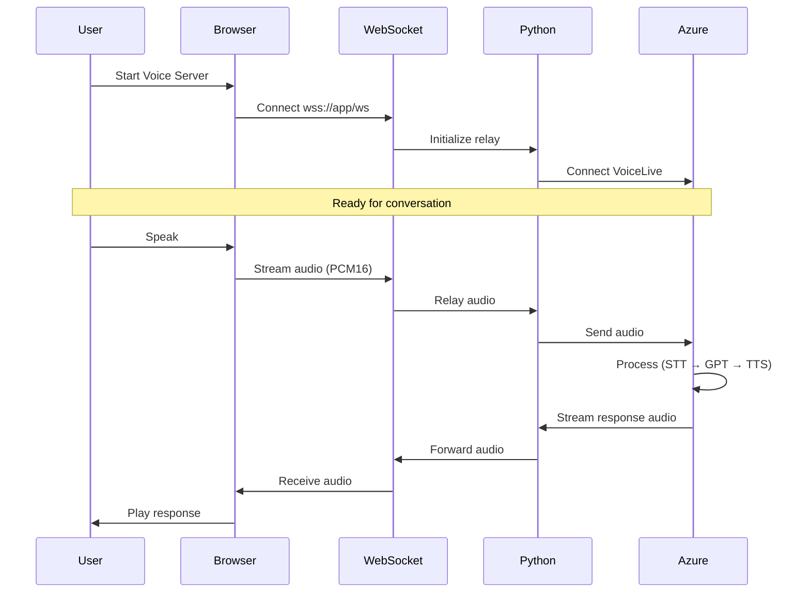
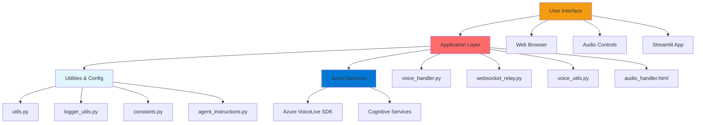
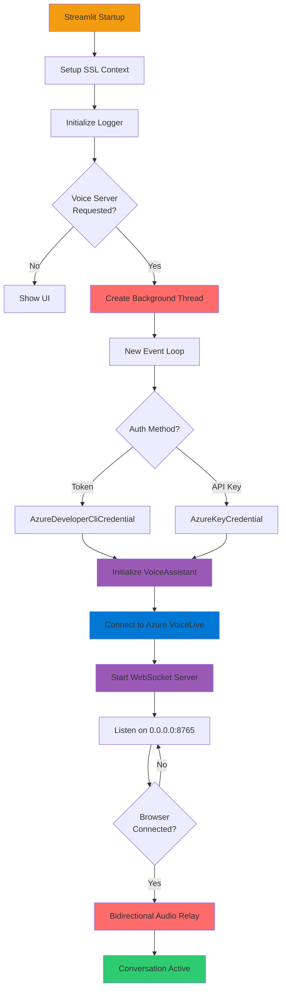

# Title: The Python Behind The Voice

# Captivating introduction to the subject

**What you'll learn:**
- How to architect a voice-first application with WebSocket bidirectional streaming
- Working with Azure VoiceLive SDK for real-time voice interaction
- Building browser-based audio capture and playback (no PyAudio needed!)
- Managing background threads and async event loops in Streamlit
- Deployment strategies for voice-enabled applications


# The application demo

- Functionalities and maybe a video of it as a demo?

# Voice data flow - real-time conversation

**TODO:** Alternative visualization of the process flow. Need to decide which one is best.



**The conversation loop:**

1. **User initiates** - Click "Start Voice Server" button in Streamlit UI
2. **Browser connects** - WebSocket connection established to `wss://your-app/ws`
3. **Server initializes** - Python creates VoiceAssistant and connects to Azure VoiceLive
4. **User speaks** - Browser captures audio via Web Audio API (ScriptProcessor) (PCM16, 24kHz)
5. **Browser streams** - Binary audio frames sent over WebSocket
6. **Server relays** - Python forwards audio to Azure VoiceLive SDK
7. **Azure processes** - Speech-to-text → GPT-4 inference → Text-to-speech
8. **Response streams back** - Azure returns audio chunks to Python
9. **Python forwards** - Audio relayed to browser via WebSocket
10. **Browser plays** - JavaScript plays audio through speakers
11. **Loop continues** - User can interrupt or continue conversation

This architecture enables the natural, real-time interaction that defines voice-first design.


# Data flow through the system (maybe use in subsequent posts?)

More detailed (too much for intro?)
The diagram below illustrates how data flows through the system in more detail:



**Key components:**

1. **User Interface Layer**
   - Web Browser (Chrome, Safari, Firefox) with microphone/speaker access
   - Audio Controls for start/stop voice interaction
   - Streamlit app for UI rendering and configuration

2. **Application Layer**
   - `voice_handler.py` - VoiceAssistant class manages Azure VoiceLive SDK connection
   - `websocket_relay.py` - WebSocket server relays audio between browser and VoiceLive
   - `voice_utils.py` - Voice server lifecycle management and background threading
   - `frontend/audio_handler.html` - JavaScript audio capture and playback

3. **Utilities & Configuration**
   - `utils.py` - Configuration utilities, SSL setup, environment detection
   - `logger_utils.py` - Centralized logging with file and console handlers
   - `constants.py` - Single source of truth for all configuration values
   - `agent_instructions.py` - Voice instructions and available voice configurations

4. **Infrastructure** (for production deployment)
   - nginx - Reverse proxy routing `/` to Streamlit (8501) and `/ws` to WebSocket (8765)
   - supervisord - Process manager for nginx and Streamlit
   - Docker - Multi-stage containerized build

5. **Azure Services**
   - Azure VoiceLive SDK with gpt-realtime-mini model
   - Azure Cognitive Services for speech processing


# Application initialization flow - remove?

The startup sequence requires careful orchestration of async operations and background threads:



**Key initialization steps:**

1. **Streamlit startup** - Main application launches
2. **SSL context setup** - Configure certificate handling for corporate environments
3. **Logger initialization** - Set up file and console logging
4. **Background thread creation** - Daemon thread for voice server (doesn't block Streamlit)
5. **Event loop setup** - New asyncio event loop for the background thread
6. **Azure authentication** - Choose between token (AzureDeveloperCliCredential) or API key
7. **VoiceAssistant initialization** - Establish connection to Azure VoiceLive
8. **WebSocket server start** - Listen on 0.0.0.0:8765 for browser connections
9. **Wait for browser** - Server ready for incoming WebSocket connections
10. **Bidirectional relay** - Audio streaming active

This careful sequencing ensures that by the time the user clicks "Start Voice Conversation," all infrastructure is ready for immediate, responsive interaction.

* * *

# Building the voice-first agent

Now that we understand the architecture, let's build it! I'll walk you through the core components, explaining key design decisions and implementation details along the way.

In this post you will see code with this comment: # ⚙️ Production feature. This means that it's a production component, and will not be discussed in this post. It will be more relevant for a later production/deployment relevant post.

## Project structure

The codebase follows a modular architecture with clear separation of concerns:

```
voice-ai-agent/
├── app.py                      # Streamlit UI (main entry point)
│
├── Core Voice Components
├── voice_handler.py            # VoiceAssistant - Azure VoiceLive connection
├── websocket_relay.py          # WebSocketAudioRelay - audio streaming
├── agent_instructions.py       # AI instructions and voice configs
│
├── Utilities & Configuration
├── utils.py                    # Config utilities (SSL, environment)
├── voice_utils.py              # Voice server management (threading)
├── logger_utils.py             # Logging configuration
├── constants.py                # Application constants
│
├── Frontend
├── frontend/
│   └── audio_handler.html      # Browser audio capture/playback
│
├── Infrastructure
├── Dockerfile                  # Multi-stage Docker build
├── docker-compose.yml          # Local development setup
├── nginx.conf                  # Reverse proxy configuration
├── supervisord.conf            # Process manager
│
└── Configuration & Docs
    ├── pyproject.toml          # Project dependencies (uv format)
    ├── .env.example            # Environment variable template
    └── README.md               # Documentation
```

This structure keeps voice logic separate from UI concerns, making the code testable, maintainable, and easy to extend.

## Core component: VoiceAssistant

The `VoiceAssistant` class in [`voice_handler.py`](https://github.com/auroravoje/voice-ai-agent/blob/main/voice_handler.py) is based on `BasicVoiceAssistant` class in [Azure's VoiceLive Quick Start documentation](https://learn.microsoft.com/en-us/azure/ai-services/speech-service/voice-live-quickstart?source=recommendations&tabs=foundry-new%2Cmacos%2Ckeyless&pivots=programming-language-python), but is modified to use websockets instead of documentation's original PyAudio dependency. This class manages the Azure VoiceLive SDK connection, and is the heart of the voice-first system:

```python
# voice_handler.py - Production implementation
"""Voice assistant handler using Azure VoiceLive SDK. AI conversation"""

import logging
import os
import ssl

import aiohttp # asynchronous HTTP client/server framework for Python, built on top of the built-in asyncio, websocket support
from azure.ai.voicelive.aio import connect
from azure.ai.voicelive.models import (
    AudioEchoCancellation,
    AudioNoiseReduction,
    AzureStandardVoice,
    InputAudioFormat,
    Modality,
    OutputAudioFormat,
    RequestSession,
    ServerVad,
)
from azure.core.credentials import AzureKeyCredential
from azure.core.credentials_async import AsyncTokenCredential
from azure.identity.aio import DefaultAzureCredential

logger = logging.getLogger(__name__)


class VoiceAssistant:
    """
    Voice assistant using Azure VoiceLive SDK.
    
    Modified for web deployment - no PyAudio dependency.
    Audio is relayed via WebSocket instead of local audio devices.
    """

    def __init__(
        self,
        endpoint: str,
        credential: AzureKeyCredential | AsyncTokenCredential,
        model: str,
        voice: str,
        instructions: str,
        ssl_context: ssl.SSLContext | None = None,  # ⚙️ Production feature
    ):
        """Initialize VoiceAssistant.
        
        Args:
            endpoint: Azure VoiceLive endpoint URL.
            credential: Azure credential (token or API key).
            model: Model name (e.g., 'gpt-realtime-mini').
            voice: Voice name (Azure or OpenAI voice).
            instructions: System prompt/instructions for the AI.
            ssl_context: Optional SSL context for corporate proxies. ⚙️
        """
        self.endpoint = endpoint
        self.credential = credential
        self.model = model
        self.voice = voice
        self.instructions = instructions
        self.ssl_context = ssl_context  # ⚙️ Production feature
        self.connection = None
        self.session_ready = False
        self._aiohttp_session = None  # ⚙️ Production feature

    async def initialize(self):
        """
        Initialize VoiceLive connection.
        
        Separate from __init__ to allow async initialization.
        Called before starting WebSocket relay.
        """
        try:
            logger.info("Initializing VoiceLive connection with model %s", self.model)

            # ⚙️ Production feature: Custom SSL for corporate proxies
            if self.ssl_context:
                connector = aiohttp.TCPConnector(ssl=self.ssl_context)
                self._aiohttp_session = aiohttp.ClientSession(connector=connector)
                logger.info("Created aiohttp session with custom SSL context")

            # Connect to VoiceLive WebSocket API
            connection_kwargs = {
                "endpoint": self.endpoint,
                "credential": self.credential,
                "model": self.model,
            }

            # ⚙️ Production feature: Use custom session if needed
            if self._aiohttp_session:
                connection_kwargs["connection_aiohttp_client_session"] = self._aiohttp_session

            # Establish connection (manual context manager for background thread)
            self.connection = await connect(**connection_kwargs).__aenter__()

            # Configure session for voice conversation
            await self._setup_session()

            logger.info("VoiceLive connection initialized and ready")

        except Exception as e:
            logger.error(f"Failed to initialize VoiceLive: {e}")
            raise

    async def _setup_session(self) -> None:
        """
        ⚙️ Production feature: Detailed session configuration.
        
        Sets up voice configuration, audio formats, modalities, and instructions.
        Starts the session for real-time bidirectional audio communication.
        
        For simpler implementations, you can pass these configs during connect().
        This method provides fine-grained control over:
        - Voice Activity Detection (VAD) parameters
        - Audio quality (echo cancellation, noise reduction)
        - Input/output formats
        - Modalities (text, audio, or both)
        """
        logger.info("Setting up voice conversation session...")

        # Create voice configuration
        voice_config: AzureStandardVoice | str # typehint (Azure VoiceLive needs objects, OpenAI needs strings)
        if self.voice.startswith("en-US-") or self.voice.startswith("en-CA-") or "-" in self.voice:
            # Azure voice format: "en-US-Ava:DragonHDLatestNeural"
            voice_config = AzureStandardVoice(name=self.voice)
        else:
            # OpenAI voice: "alloy", "echo", "fable", "onyx", "nova", "shimmer"
            voice_config = self.voice

        # Configure Voice Activity Detection (VAD)
        turn_detection_config = ServerVad(
            threshold=0.5,              # Sensitivity (0.0-1.0)
            prefix_padding_ms=300,      # Audio before speech starts
            silence_duration_ms=500     # Silence before turn ends
        )

        # Create comprehensive session configuration
        session_config = RequestSession(
            modalities=[Modality.TEXT, Modality.AUDIO],
            instructions=self.instructions,
            voice=voice_config,
            input_audio_format=InputAudioFormat.PCM16,
            output_audio_format=OutputAudioFormat.PCM16,
            turn_detection=turn_detection_config,
            input_audio_echo_cancellation=AudioEchoCancellation(),  # ⚙️ Improves quality
            input_audio_noise_reduction=AudioNoiseReduction(        # ⚙️ Removes background noise
                type="azure_deep_noise_suppression"
            ),
        )

        assert self.connection is not None, "Connection must be established"
        await self.connection.session.update(session=session_config)

        self.session_ready = True
        logger.info("Session configuration complete")

    async def cleanup(self):
        """
        ⚙️ Production feature: Proper resource cleanup.
        
        For simpler implementations, you can just close the connection.
        This ensures all resources are released properly.
        """
        if self.connection:
            try:
                await self.connection.__aexit__(None, None, None)
            except Exception as e:
                logger.error(f"Error closing VoiceLive connection: {e}")
            self.connection = None

        if self._aiohttp_session:
            try:
                await self._aiohttp_session.close()
            except Exception as e:
                logger.error(f"Error closing aiohttp session: {e}")
            self._aiohttp_session = None

        logger.info("VoiceAssistant cleanup complete")


# Helper functions for authentication and SSL

def get_credential(use_token: bool = False) -> AzureKeyCredential | AsyncTokenCredential:
    """Get appropriate Azure credential for authentication.
    
    Args:
        use_token: If True, use DefaultAzureCredential (token-based auth).
                   If False, use API key from environment variable.
    
    Returns:
        Azure credential instance (token or API key based).
    
    Raises:
        ValueError: If use_token is False and AZURE_VOICELIVE_API_KEY is not set.
    """
    if use_token:
        return DefaultAzureCredential()
    else:
        api_key = os.getenv("AZURE_VOICELIVE_API_KEY")
        if not api_key:
            raise ValueError("AZURE_VOICELIVE_API_KEY not set in environment")
        return AzureKeyCredential(api_key)


def get_ssl_context() -> ssl.SSLContext | None:
    """
    ⚙️ Production feature: SSL context for corporate proxy environments.
    
    Reads certificate path from CORP_CERT_PATH environment variable
    and creates an SSL context with the custom certificate bundle.
    
    Returns:
        SSL context if certificate path exists, None otherwise.
    """
    corp_cert_path = os.path.expanduser(os.getenv("CORP_CERT_PATH", ""))
    if corp_cert_path and os.path.exists(corp_cert_path):
        ssl_context = ssl.create_default_context(cafile=corp_cert_path)
        logger.info(f"Using corporate certificate: {corp_cert_path}")
        return ssl_context
    return None
```

<details markdown=1>
<summary>Understanding the syntax: `await connect(...).__aenter__()` ⏬</summary>

**What's happening here?**

This line manually invokes an async context manager's enter method. Let's break it down piece by piece:

```python
self.connection = await connect(**connection_kwargs).__aenter__()
#                       ↑                ↑              ↑
#                       1                2              3
```

**1. `connect(**connection_kwargs)`**
- Calls the `connect()` function with unpacked keyword arguments
- Returns an **async context manager** (like opening a connection)
- `**` unpacks the dict: `{"endpoint": "...", "credential": ...}` → `endpoint="...", credential=...`

**2. `.__aenter__()`**
- Manually calls the context manager's "enter" method
- Returns a coroutine that establishes the connection
- `__aenter__` is what `async with` calls behind the scenes

**3. `await`**
- Waits for the connection to be established
- Returns the connected session object

**Normal vs. manual context manager:**

Normally, you'd use an async context manager like this:

```python
# Normal usage with async with:
async with connect(endpoint, credential, model) as connection:
    # Use connection here
    await connection.send_audio(...)
# Connection automatically closes when leaving the block
```

But we can't use `async with` here because:
1. **The connection needs to persist** - It must stay open for the entire lifetime of the VoiceAssistant
2. **Background thread** - The connection lives across multiple method calls
3. **Manual cleanup** - We control when to close it (in the `cleanup()` method)

**The manual approach:**

```python
# Manually open (in initialize()):
self.connection = await connect(...).__aenter__()

# Use it later (in websocket relay):
await self.connection.send_audio(...)

# Manually close (in cleanup()):
await self.connection.__aexit__(None, None, None)
```

Notice in the `cleanup()` method you'll see the matching `__aexit__()` call that closes the connection.

**Why `__aenter__()` specifically?**

Context managers in Python have two magic methods:
- `__aenter__()` - Called when entering the context (connects)
- `__aexit__()` - Called when exiting the context (disconnects)

The `async with` statement calls these automatically, but we call them manually to control the connection lifetime precisely.

**In summary:** This is a low-level pattern for when you need fine-grained control over resource lifecycle, rather than the automatic cleanup of `async with`.

</details>

**Key design decisions:**

1. **Async initialization pattern** - `__init__` is sync, `initialize()` is async for proper async context
<details markdown=1>
<summary>New to async/await? Understanding the initialization pattern ⏬</summary>

**What is `async`/`await`?**

In Python, `async`/`await` is syntax for writing *asynchronous* code that can handle multiple operations concurrently without blocking. Think of it like this:

- **Synchronous (normal) code**: Do task A, wait for it to finish, then do task B, wait for it to finish, etc.
- **Asynchronous code**: Start task A, and while waiting for it, start task B, etc. Handle results as they complete.

This is crucial for I/O-bound operations like network requests, where you spend most of your time waiting for responses.

**The syntax:**
```python
# Regular function - runs synchronously
def get_data():
    return requests.get("https://api.example.com")

# Async function - can run concurrently with other async operations
async def get_data():
    return await aiohttp.get("https://api.example.com")
    #      ↑ "await" says "pause here until this finishes, but let other code run"
```

**Why can't `__init__` be async?**

Python's `__init__` method is called when you create an object:
```python
assistant = VoiceAssistant(endpoint, credential, ...)  # Calls __init__
```

This line must return a VoiceAssistant object *immediately*. But `async` functions don't return values directly—they return *coroutines* that need to be `await`-ed:

```python
# This Won't Work:
async def __init__(self, ...):
    await connect_to_azure()  # Can't await in __init__!
```

**The solution: Split initialization into two steps**

1. **`__init__`** - Sets up basic attributes (sync, no network calls)
2. **`initialize()`** - Does async operations (network connections, etc.)

```python
# Step 1: Create the object (instant)
assistant = VoiceAssistant(endpoint, credential, model, voice, instructions)

# Step 2: Initialize async resources (waits for connection)
await assistant.initialize()
```

**Why we need this in VoiceAssistant:**

Our voice assistant needs to:
- Connect to Azure VoiceLive (network I/O - async)
- Configure audio streaming session (network I/O - async)
- Handle websocket connections (I/O - async)

All of these are I/O-bound operations that benefit from async handling. The two-step pattern gives us:
- A valid object immediately (from `__init__`)
- Async initialization that can run alongside other async operations
- Proper resource management in an async context

**In practice:**
```python
# In voice_utils.py background thread:
assistant = VoiceAssistant(endpoint, credential, model, voice, instructions)  # Fast
await assistant.initialize()  # Connects to Azure, sets up session

# Now ready to stream audio!
```

This pattern is common in async Python when you need to perform I/O during initialization.

</details>


2. **Flexible authentication** - Supports both API key (simple) and token-based auth (secure via DefaultAzureCredential)
3. **Server-side VAD** - Voice Activity Detection handled by Azure with configurable parameters (see `_setup_session()` method where `ServerVad` configures `threshold`, `prefix_padding_ms`, and `silence_duration_ms` to control when the AI detects speech starts/stops and turn-taking)
4. **Production-ready features** (marked with ⚙️):
   - SSL context support for corporate proxies
   - Custom aiohttp session for advanced networking
   - Detailed session configuration (echo cancellation, noise reduction)
   - Comprehensive error handling and logging
   - Proper resource cleanup
5. **Audio quality controls** - Echo cancellation and deep noise suppression for clear conversation
6. **Dual voice support** - Works with both Azure voices and OpenAI voices

**Simplification note:** For learning or prototypes, you can simplify this by:
- Removing SSL context handling
- Using basic session configuration passed to `connect()`
- Simple `close()` instead of comprehensive `cleanup()`
- Removing the aiohttp session customization

The audio streaming methods (`send_audio()` and `receive_events()`) are implemented in the WebSocket relay layer (see next section) as they work directly with `self.connection` established here

## WebSocket relay: Bridging browser and Azure

The `WebSocketAudioRelay` class in [websocket_relay.py](https://github.com/auroravoje/voice-ai-agent/blob/main/websocket_relay.py) is the bridge between browser audio and Azure VoiceLive. This is the production implementation with comprehensive event handling and logging:

```python
# websocket_relay.py - Production implementation
"""WebSocket relay between browser audio and Azure VoiceLive. Network communication."""

import asyncio
import base64
import logging
from typing import Optional

import websockets
from azure.ai.voicelive.models import ServerEventType

logger = logging.getLogger(__name__)


class WebSocketAudioRelay:
    """
    Relays audio between browser (WebSocket) and VoiceLive API.
    
    Flow:
    1. Browser sends audio via WebSocket → relay to VoiceLive
    2. VoiceLive sends audio response → relay to browser
    """

    def __init__(self, voice_assistant):
        """
        Initialize relay with VoiceAssistant instance.
        
        Args:
            voice_assistant: VoiceAssistant instance with active VoiceLive connection
        """
        self.voice_assistant = voice_assistant
        self.browser_ws: Optional[websockets.WebSocketServerProtocol] = None
        self.is_running = False

    async def handle_browser_connection(self, websocket: websockets.WebSocketServerProtocol):
        """
        Handle WebSocket connection from browser.
        
        Args:
            websocket: WebSocket connection from browser
        """
        self.browser_ws = websocket
        self.is_running = True
        
        logger.info("Browser connected to WebSocket relay")
        
        try:
            # Start two concurrent tasks:
            # 1. Receive audio from browser → send to VoiceLive
            # 2. Receive audio from VoiceLive → send to browser
            await asyncio.gather(
                self._browser_to_voicelive(),
                self._voicelive_to_browser(),
            )
        except Exception as e:
            logger.error(f"Relay error: {e}")
        finally:
            self.is_running = False
            logger.info("Browser disconnected from WebSocket relay")

    async def _browser_to_voicelive(self) -> None:
        """
        Receive audio from browser and send to VoiceLive.
        
        Flow: Browser mic → WebSocket → VoiceLive API
        
        Continuously receives binary audio frames from the browser WebSocket,
        converts them to base64, and appends to VoiceLive's input buffer.
        
        Logs progress every 100 audio chunks received.
        """
        audio_chunks_received = 0  # chunk tracking
        try:
            async for message in self.browser_ws:
                if not self.is_running:
                    break
                
                # Message is binary audio data (PCM16)
                if isinstance(message, bytes):
                    audio_chunks_received += 1
                    
                    # Log every 100 chunks
                    if audio_chunks_received % 100 == 0:
                        logger.info(f"Received {audio_chunks_received} audio chunks from browser")
                    
                    # Convert binary audio to base64 string for VoiceLive API
                    # VoiceLive requires base64-encoded audio (text-safe representation)
                    audio_base64 = base64.b64encode(message).decode('utf-8')
                    
                    # Send to VoiceLive input audio buffer
                    voicelive_conn = self.voice_assistant.connection
                    if voicelive_conn:
                        await voicelive_conn.input_audio_buffer.append(audio=audio_base64)
                    else:
                        logger.error("VoiceLive connection is None!")  
                    
        except websockets.exceptions.ConnectionClosed:
            logger.info("Browser WebSocket connection closed")
        except Exception as e:
            logger.error(f"Error in browser_to_voicelive: {e}", exc_info=True)  

    async def _voicelive_to_browser(self) -> None:
        """
        Receive audio from VoiceLive and send to browser.
        
        Flow: VoiceLive AI → VoiceLive API → WebSocket → Browser speakers
        
        Continuously receives server events from VoiceLive, extracts audio
        responses, converts from base64 to binary, and sends to browser WebSocket.
        
        Handles response.done events for conversation turn completion.
        """
        try:
            voicelive_conn = self.voice_assistant.connection
            if not voicelive_conn:
                logger.error("No VoiceLive connection available")
                return
            
            # Process VoiceLive events
            async for event in voicelive_conn:
                if not self.is_running:
                    break
                
                await self._handle_voicelive_event(event)
                
        except Exception as e:
            logger.error(f"Error in voicelive_to_browser: {e}")

    async def _handle_voicelive_event(self, event):
        """
        Handle VoiceLive events and relay audio to browser.
        
        Processes different event types from VoiceLive SDK:
        - SESSION_UPDATED: Session initialized
        - INPUT_AUDIO_BUFFER_SPEECH_STARTED/STOPPED: User speech detection
        - RESPONSE_CREATED: AI started generating response
        - RESPONSE_AUDIO_DELTA: Audio chunks to play
        - RESPONSE_AUDIO_DONE/RESPONSE_DONE: Turn completion
        - ERROR: Error messages from VoiceLive
        
        Args:
            event: Event from VoiceLive connection
        """
        logger.debug(f"VoiceLive event: {event.type}")
        
        if event.type == ServerEventType.SESSION_UPDATED:
            logger.info(f"VoiceLive session ready: {event.session.id}")
            
        elif event.type == ServerEventType.INPUT_AUDIO_BUFFER_SPEECH_STARTED:
            logger.info("User started speaking")
            # Could send status update to browser here
            
        elif event.type == ServerEventType.INPUT_AUDIO_BUFFER_SPEECH_STOPPED:
            logger.info("User stopped speaking")
            
        elif event.type == ServerEventType.RESPONSE_CREATED:
            logger.info("AI response created")
            
        elif event.type == ServerEventType.RESPONSE_AUDIO_DELTA:
            # This is the AI's audio response - send to browser
            if self.browser_ws and event.delta:
                try:
                    await self.browser_ws.send(event.delta)
                    logger.info(f"✅ Sent audio delta to browser, size: {len(event.delta)} bytes")
                except Exception as e:
                    logger.error(f"Error sending audio to browser: {e}")
            else:
                # diagnostics
                if not self.browser_ws:
                    logger.warning("No browser WebSocket to send audio to!")
                if not event.delta:
                    logger.warning("Audio delta is empty!")
                    
        elif event.type == ServerEventType.RESPONSE_AUDIO_DONE:
            logger.info("AI finished speaking")
            
        elif event.type == ServerEventType.RESPONSE_DONE:
            logger.info("Response complete")
            
        elif event.type == ServerEventType.ERROR:
            error_msg = event.error.message
            logger.error(f"VoiceLive error: {error_msg}")  
            
        elif event.type == ServerEventType.CONVERSATION_ITEM_CREATED:
            logger.debug(f"Conversation item: {event.item.id}")

    async def stop(self):
        """Stop the relay and close connections."""
        self.is_running = False
        if self.browser_ws:
            await self.browser_ws.close()
            self.browser_ws = None
        logger.info("WebSocket relay stopped")
```

<details markdown=1>
<summary>Understanding the syntax on input audio buffer in _browser_to_voicelive(): ⏬</summary>

```python
    # Send to VoiceLive input audio buffer
    voicelive_conn = self.voice_assistant.connection
    if voicelive_conn:
        await voicelive_conn.input_audio_buffer.append(audio=audio_base64)
    else:
        logger.error("VoiceLive connection is None!")
```
The input audio buffer is a queue (or staging area) on the Azure VoiceLive connection where you continuously append audio chunks for processing. Think of it as a conveyor belt:

Your App → [Buffer: chunk1, chunk2, chunk3...] → Azure AI Processing

Why "input" audio buffer?
"Input" = Audio going into Azure (from your app's perspective)
"Buffer" = Temporary storage that accumulates data before processing
There's also an output audio buffer where Azure puts response audio for you to retrieve.

How it works:
Browser captures audio in small chunks (every 100ms)
WebSocket receives each chunk as binary data
Your code converts to base64
.append(audio=...) adds the chunk to Azure's input buffer
Azure processes audio in real-time as chunks arrive
VAD (Voice Activity Detection) determines when you've stopped speaking
AI generates response based on accumulated audio
Why .append() instead of sending all at once?
Streaming architecture! This enables:

- ✅ Low latency - Azure starts processing while you're still speaking
- ✅ Natural conversation - No need to wait for complete utterances
- ✅ Interruption handling - You can cut off the AI mid-response
- ✅ Memory efficiency - No need to buffer entire audio files
The if voicelive_conn: check
This is defensive programming:

Verifies the connection exists before using it
Prevents crashes if initialization failed
Logs an error if something went wrong
await keyword
The await is necessary because .append() is an async operation - it sends data over the network to Azure, which takes time. The await pauses execution until the network operation completes.

Real-world analogy:
Imagine a restaurant where you're ordering:

Input audio buffer = The order queue where dishes are called out
.append() = Kitchen receives each dish request one at a time
Streaming = Kitchen starts preparing the first dish while you're still ordering others
Traditional approach = You'd have to finish your entire order before kitchen starts cooking anything
That's why streaming with a buffer creates a more responsive, real-time experience!

</details>


**Key design decisions:**

- **Bidirectional relay** - Two concurrent async tasks `_browser_to_voicelive()` and `_voicelive_to_browser()` handle audio streaming in both directions
- **Base64 encoding** - VoiceLive API requires base64-encoded audio; binary WebSocket data is converted appropriately
- **Event-driven architecture** - Uses Azure's `ServerEventType` enum to handle different conversation events
- **Buffer management** - Direct access to `input_audio_buffer.append()` for efficient streaming
- **Validation and tracking, logging, and error handling**:
   - Comprehensive event logging for debugging conversation flow
   - Progress tracking (logs every 100 audio chunks)
   - Detailed error handling with `exc_info=True` for stack traces
   - Connection validation before operations
   - Graceful shutdown with proper cleanup

## Browser audio: Browser JavaScript capture and playback

The [frontend/audio_handler.html](https://github.com/auroravoje/voice-ai-agent/blob/main/frontend/audio_handler.html) file contains JavaScript for browser-based audio. This is the production implementation with full iOS compatibility, proper audio format handling, and comprehensive error management:

```html
<!-- frontend/audio_handler.html - Production implementation -->
<!DOCTYPE html>
<html>
<head>
    <meta charset="UTF-8">
    <meta name="viewport" content="width=device-width, initial-scale=1.0">
    <title>Voice Agent Audio Handler</title>
</head>
<body>
    <div id="audio-component">
        <button id="start-button" onclick="startVoiceAgent()">🎤 Start Conversation</button>
        <button id="stop-button" onclick="stopVoiceAgent()" disabled>⏹️ Stop</button>
        <div id="status">Ready</div>
        <div id="ios-hint" style="display:none; /* ⚙️ iOS-specific hints */">
            <strong>iOS/iPhone Users:</strong> If prompted, please allow microphone access.
        </div>
    </div>

    <script>
        // Audio configuration (matching VoiceLive requirements)
        const SAMPLE_RATE = 24000;  // 24kHz - VoiceLive requirement
        const CHANNELS = 1;          // Mono
        const CHUNK_SIZE = 2048;     // Must be power of 2 = ~85ms chunks

        let mediaStream = null;
        let audioContext = null;
        let processor = null;      // ScriptProcessor for audio capture
        let websocket = null;
        let audioQueue = [];
        let isPlaying = false;

        /**
         * Start the voice agent - captures microphone and connects to server
         */
        async function startVoiceAgent() {
            // ⚙️ Production: Disable button to prevent double-clicks
            document.getElementById('start-button').disabled = true;
            
            try {
                updateStatus('Requesting microphone access...', 'info');
                
                // ⚙️ Production: iOS-compatible constraints
                const constraints = {
                    audio: {
                        echoCancellation: true,     // Remove echo
                        noiseSuppression: true,     // Remove background noise
                        autoGainControl: true       // Normalize volume
                    }
                };
                
                // ⚙️ iOS workaround: Don't request specific sample rate
                const isIOS = /iPad|iPhone|iPod/.test(navigator.userAgent);
                if (!isIOS) {
                    constraints.audio.sampleRate = SAMPLE_RATE;
                    constraints.audio.channelCount = CHANNELS;
                }
                
                mediaStream = await navigator.mediaDevices.getUserMedia(constraints);
                console.log('✅ Microphone access granted');
                
                updateStatus('Connecting to server...', 'info');
                
                // ⚙️ Production: Smart WebSocket URL detection
                const protocol = window.parent.location.protocol === 'https:' ? 'wss:' : 'ws:';
                const host = window.parent.location.hostname || 'localhost';
                const isDev = host === 'localhost' || host === '127.0.0.1';
                const wsUrl = isDev 
                    ? `${protocol}//${host}:8765`      // Direct to WebSocket port
                    : `${protocol}//${host}/ws`;        // Through nginx proxy
                
                websocket = new WebSocket(wsUrl);
                websocket.binaryType = 'arraybuffer';  // Binary audio data
                
                websocket.onopen = () => {
                    updateStatus('Connected! Start speaking...', 'success');
                    startAudioCapture();
                    document.getElementById('stop-button').disabled = false;
                };

                websocket.onmessage = (event) => {
                    // Receive audio from server (AI response)
                    handleIncomingAudio(event.data);
                };

                // ⚙️ Production error handling
                websocket.onerror = (error) => {
                    updateStatus('WebSocket connection error', 'error');
                    console.error('❌ WebSocket error:', error);
                    alert('Connection Error: Check if voice server is running.');
                };

                websocket.onclose = (event) => {
                    updateStatus('Connection closed', 'info');
                    if (!event.wasClean) {
                        alert(`Connection Lost. Please start voice server first.`);
                    }
                    stopVoiceAgent();
                };

            } catch (error) {
                updateStatus('Error: ' + error.message, 'error');
                console.error('❌ Error:', error);
                
                // ⚙️ Production: User-friendly error messages
                let errorMsg = error.message;
                if (error.name === 'NotAllowedError') {
                    errorMsg = 'Microphone access denied. Please allow in browser settings.';
                } else if (error.name === 'NotFoundError') {
                    errorMsg = 'No microphone found.';
                } else if (error.name === 'NotReadableError') {
                    errorMsg = 'Microphone in use by another app.';
                }
                alert('Error: ' + errorMsg);
                
                document.getElementById('start-button').disabled = false;
            }
        }

        /**
         * Start capturing audio from microphone using ScriptProcessor
         */
        function startAudioCapture() {
            // Create audio context with VoiceLive sample rate
            audioContext = new (window.AudioContext || window.webkitAudioContext)({
                sampleRate: SAMPLE_RATE
            });

            const source = audioContext.createMediaStreamSource(mediaStream);
            
            // Create script processor for raw PCM audio capture
            processor = audioContext.createScriptProcessor(CHUNK_SIZE, CHANNELS, CHANNELS);
            
            processor.onaudioprocess = (event) => {
                if (!websocket || websocket.readyState !== WebSocket.OPEN) return;

                // Get audio data (Float32Array from browser)
                const inputData = event.inputBuffer.getChannelData(0);
                
                // Convert Float32 to PCM16 (VoiceLive requirement)
                const pcm16 = float32ToInt16(inputData);
                
                // Send binary data to server
                websocket.send(pcm16.buffer);
            };

            source.connect(processor);
            processor.connect(audioContext.destination);
        }

        /**
         * Handle incoming audio from server (AI speaking)
         */
        function handleIncomingAudio(arrayBuffer) {
            // Queue audio for sequential playback
            audioQueue.push(arrayBuffer);
            
            if (!isPlaying) {
                playAudioQueue();
            }
        }

        /**
         * Play queued audio through speakers
         */
        async function playAudioQueue() {
            if (audioQueue.length === 0) {
                isPlaying = false;
                return;
            }

            isPlaying = true;
            const audioData = audioQueue.shift();
            
            try {
                // Convert PCM16 back to Float32 for playback
                const int16Array = new Int16Array(audioData);
                const float32Array = int16ToFloat32(int16Array);
                
                // Create audio buffer
                const audioBuffer = audioContext.createBuffer(
                    CHANNELS, 
                    float32Array.length, 
                    SAMPLE_RATE
                );
                audioBuffer.getChannelData(0).set(float32Array);
                
                // Play audio
                const source = audioContext.createBufferSource();
                source.buffer = audioBuffer;
                source.connect(audioContext.destination);
                
                source.onended = () => {
                    playAudioQueue(); // Play next in queue
                };
                
                source.start(0);
            } catch (error) {
                console.error('❌ Error playing audio:', error);
                playAudioQueue(); // Continue with next chunk
            }
        }

        /**
         * Stop voice agent and clean up resources
         */
        function stopVoiceAgent() {
            // ⚙️ Production: Proper cleanup of all resources
            if (processor) {
                processor.disconnect();
                processor = null;
            }
            
            if (audioContext) {
                audioContext.close();
                audioContext = null;
            }
            
            if (mediaStream) {
                mediaStream.getTracks().forEach(track => track.stop());
                mediaStream = null;
            }
            
            if (websocket) {
                websocket.close();
                websocket = null;
            }
            
            audioQueue = [];
            isPlaying = false;
            
            document.getElementById('start-button').disabled = false;
            document.getElementById('stop-button').disabled = true;
            updateStatus('Stopped', 'info');
        }

        /**
         * Convert Float32Array to Int16Array (PCM16 format for VoiceLive)
         */
        function float32ToInt16(float32Array) {
            const int16Array = new Int16Array(float32Array.length);
            for (let i = 0; i < float32Array.length; i++) {
                // Clamp to [-1, 1] range
                const s = Math.max(-1, Math.min(1, float32Array[i]));
                // Scale to 16-bit integer range
                int16Array[i] = s < 0 ? s * 0x8000 : s * 0x7FFF;
            }
            return int16Array;
        }

        /**
         * Convert Int16Array (PCM16) to Float32Array for playback
         */
        function int16ToFloat32(int16Array) {
            const float32Array = new Float32Array(int16Array.length);
            for (let i = 0; i < int16Array.length; i++) {
                // Normalize to [-1, 1] range
                float32Array[i] = int16Array[i] / (int16Array[i] < 0 ? 0x8000 : 0x7FFF);
            }
            return float32Array;
        }

        /**
         * Update status message with visual feedback
         */
        function updateStatus(message, type = 'info') {
            const statusDiv = document.getElementById('status');
            statusDiv.textContent = message;
            statusDiv.className = type;
            
            // ⚙️ Production: Send status to parent Streamlit frame
            if (window.parent) {
                window.parent.postMessage({
                    type: 'voice-status',
                    status: message,
                    statusType: type
                }, '*');
            }
        }

        // Clean up on page unload
        window.addEventListener('beforeunload', stopVoiceAgent);
    </script>

    <!-- Styles omitted for brevity -->
</body>
</html>
```

<details markdown=1>
<summary>JavaScript syntax refresher for Python developers ⏬</summary>

If you're coming from Python, here are key JavaScript concepts used in this code:

**1. Variable declarations: `let`, `const`, `var`**

JavaScript has three ways to declare variables:

```javascript
let mediaStream = null;      // Block-scoped, can be reassigned
const SAMPLE_RATE = 24000;   // Block-scoped, CANNOT be reassigned (constant)
var oldStyle = "data";       // Function-scoped (old style, avoid)
```

- **`let`** - Modern way for variables that change (like Python's normal assignment)
- **`const`** - For values that won't change (enforced at compile time)
- **`var`** - Old style with confusing scope rules, now considered legacy

Python equivalent:
```python
media_stream = None          # Normal assignment (can change)
SAMPLE_RATE = 24000          # Convention, but not enforced
```

---

**2. No imports for browser APIs**

Unlike Python, browser JavaScript has many **global APIs** available without imports:

```javascript
// These work without any imports:
navigator.mediaDevices.getUserMedia()
new WebSocket('wss://...')
new AudioContext()
```

**Python equivalent would be:**
```python
import asyncio        # Must import
import websockets     # Must install and import
```

**Why no imports?**
- Browser APIs are built into the browser runtime
- Everything in `window` namespace is globally accessible
- This HTML uses inline `<script>` (single-file approach)

**Modern JavaScript modules DO have imports:**
```javascript
// In separate .js files with ES6 modules
import { connect } from './azure-voicelive.js';
export function myFunction() { }
```

But for simplicity, this HTML uses inline scripts with globals.

---

**3. Documentation: JSDoc (like docstrings)**

JavaScript uses **JSDoc** comments (the `/** */` syntax):

```javascript
/**
 * Convert Float32Array to Int16Array (PCM16 format for VoiceLive)
 * 
 * @param {Float32Array} float32Array - Input audio data
 * @returns {Int16Array} Converted PCM16 audio data
 */
function float32ToInt16(float32Array) {
    // ...
}
```

**Python equivalent:**
```python
def float32_to_int16(float32_array: np.ndarray) -> np.ndarray:
    """
    Convert Float32Array to Int16Array (PCM16 format for VoiceLive).
    
    Args:
        float32_array: Input audio data
        
    Returns:
        Converted PCM16 audio data
    """
```

**Type hints in JavaScript:**
- Plain JavaScript has NO type hints
- **TypeScript** adds types: `function fn(x: number): string { }`
- **JSDoc** provides type annotations in comments for IDEs

This code uses JSDoc comments (visible in the full HTML).

---

**4. Naming conventions: shorter function names**

JavaScript developers often use shorter, type-based names:

```javascript
// JavaScript style (more common)
float32ToInt16()       // "Float32 to Int16"
int16ToFloat32()       // "Int16 to Float32"

// Python/verbose style (also valid)
convertFloat32ToInt16()
convertInt16ToFloat32()
```

**Why shorter names?**
- JavaScript tradition favors brevity
- Types are clear from the name
- Built-in APIs use this pattern:
  - `JSON.stringify()` not `convertObjectToJSON()`
  - `String.fromCharCode()` not `createStringFromCharCode()`

Both styles are acceptable - shorter is more idiomatic JavaScript.

---

**5. Other JavaScript vs Python differences in this code**

| JavaScript | Python | Notes |
|------------|--------|-------|
| `async function foo()` | `async def foo()` | Async syntax is similar |
| `await expression` | `await expression` | Same async/await pattern |
| `() => {}` | `lambda:` | Arrow functions (anonymous) |
| `null` | `None` | Null value |
| `===` | `==` | Strict equality (use this, not `==`) |
| `!` | `not` | Boolean negation |
| `&&` | `and` | Logical AND |
| <code>&#124;&#124;</code> | `or` | Logical OR |
| `array.push()` | `list.append()` | Add to array/list |
| `array.shift()` | `list.pop(0)` | Remove first element |

**Async/await is nearly identical:**
```javascript
// JavaScript
async function getData() {
    const result = await fetch('...');
    return result;
}
```

```python
# Python
async def get_data():
    result = await fetch('...')
    return result
```

</details>

**Key design decisions:**

1. **ScriptProcessor for raw audio capture** - Direct access to PCM audio data (browsers provide Float32, we convert to PCM16 for VoiceLive)
2. **iOS compatibility** - Conditional constraints avoid iOS-specific microphone issues
3. **Smart WebSocket URL detection** - Development vs. production routing (direct port or nginx proxy)
4. **PCM16 audio format** - VoiceLive requires 16-bit PCM, browsers use 32-bit float, conversion functions handle this
5. **Production-ready features** (marked with ⚙️):
   - Comprehensive error messages for different failure modes
   - Button state management to prevent double-clicks
   - Resource cleanup on all exit paths
   - Status communication to parent Streamlit frame
   - Audio queue management for smooth playback
6. **Real-time audio processing** - `ScriptProcessor.onaudioprocess` fires every ~85ms (2048 samples / 24000 Hz)
7. **Binary WebSocket** - `binaryType = 'arraybuffer'` for efficient audio transmission

**Why ScriptProcessor instead of MediaRecorder?**

The simplified example used `MediaRecorder`, but production uses `ScriptProcessor` because:
- ✅ **Raw PCM access** - Direct control over audio format (VoiceLive needs PCM16, not WebM)
- ✅ **No codec overhead** - No encoding/decoding, just format conversion
- ✅ **Exact sample rate** - Guaranteed 24kHz output
- ✅ **Consistent chunk timing** - Predictable ~85ms intervals

MediaRecorder would introduce codec conversion, variable chunk sizes, and format incompatibilities.

<details markdown=1>
<summary>Understanding browser audio concepts ⏬</summary>

**What is Float32 vs PCM16?**

Browsers and APIs use different audio formats:

**Float32Array (Browser's native format):**
- Values range from `-1.0` to `+1.0`
- Used by Web Audio API internally
- 32 bits (4 bytes) per sample
- High precision, no integer rounding

**PCM16 (Azure VoiceLive requirement):**
- Values range from `-32768` to `+32767` (16-bit signed integer)
- Industry standard for voice/telephony
- 16 bits (2 bytes) per sample
- Half the size of Float32, less bandwidth

**Conversion:** `float32ToInt16()` and `int16ToFloat32()` scale values between formats.

---

**What is ScriptProcessor?**

`ScriptProcessorNode` is a Web Audio API node that gives you **raw, unprocessed audio samples** in real-time.

```javascript
processor = audioContext.createScriptProcessor(
    2048,     // Buffer size (power of 2: 256-16384)
    1,        // Input channels (1 = mono)
    1         // Output channels
);

processor.onaudioprocess = (event) => {
    // Called every ~85ms (2048 samples / 24000 Hz)
    const audioData = event.inputBuffer.getChannelData(0);  // Float32Array
    // Process audioData here
};
```

**Why buffer size matters:**
- **Smaller buffers** (256 samples): Lower latency (~10ms) but more CPU intensive
- **Larger buffers** (16384 samples): Less frequent processing but higher latency (~680ms)
- **2048 samples at 24kHz**: Sweet spot of ~85ms latency for voice

---

**What is getUserMedia()?**

`navigator.mediaDevices.getUserMedia()` is the browser API for accessing microphone/camera.

```javascript
const stream = await navigator.mediaDevices.getUserMedia({
    audio: {
        echoCancellation: true,    // Remove acoustic echo
        noiseSuppression: true,    // Filter background noise
        autoGainControl: true,     // Normalize volume
        sampleRate: 24000,         // Preferred sample rate
        channelCount: 1            // Mono audio
    }
});
```

**User permissions:** Browser prompts user to allow/deny. On denial, throws `NotAllowedError`.

**iOS quirk:** Safari on iOS doesn't respect `sampleRate` constraint, so we omit it for iOS devices.

---

**What is WebSocket binaryType?**

WebSockets can send/receive two data types:

```javascript
websocket.binaryType = 'arraybuffer';  // ← Set before receiving data
                       // or 'blob'
```

- **`'arraybuffer'`** - Data arrives as `ArrayBuffer` (fast, direct memory access)
- **`'blob'`** - Data arrives as `Blob` (slower, file-like object)

For audio streaming, `arraybuffer` is faster because we can directly create typed arrays:

```javascript
websocket.onmessage = (event) => {
    const int16Data = new Int16Array(event.data);  // Direct conversion
    // vs blob: must await blob.arrayBuffer() first
};
```

---

**What is an audio queue?**

AI responses arrive as multiple small audio chunks. Playing them immediately would create gaps/stuttering. A queue ensures smooth playback:

```javascript
let audioQueue = [];
let isPlaying = false;

function handleIncomingAudio(data) {
    audioQueue.push(data);       // Add to queue
    if (!isPlaying) {
        playAudioQueue();         // Start if not already playing
    }
}

async function playAudioQueue() {
    if (audioQueue.length === 0) {
        isPlaying = false;
        return;
    }
    
    isPlaying = true;
    const chunk = audioQueue.shift();  // Get first item
    
    // Play chunk...
    source.onended = playAudioQueue;   // Chain to next chunk
}
```

This creates seamless audio playback even though data arrives in bursts.

---

**Why `audioContext.createBuffer()` for playback?**

`AudioContext` is the Web Audio API's audio processing system. To play raw PCM data:

```javascript
// 1. Create empty buffer with correct size
const audioBuffer = audioContext.createBuffer(
    1,                    // channels (mono)
    samples.length,       // length
    24000                 // sample rate
);

// 2. Copy data into buffer
audioBuffer.getChannelData(0).set(float32Samples);

// 3. Create source and play
const source = audioContext.createBufferSource();
source.buffer = audioBuffer;
source.connect(audioContext.destination);  // Route to speakers
source.start(0);                            // Start immediately
```

This is more flexible than HTML5 `<audio>` element and allows precise timing/mixing.

</details>

## Streamlit integration: Voice server lifecycle

The `voice_utils.py` module manages the voice server lifecycle in a background thread:

```python
# voice_utils.py ⚙️ (full production version)
"""Voice-related utilities: UI components, WebSocket server, and background thread management."""

import asyncio
import os
import traceback
from pathlib import Path

import websockets

import constants
import logger_utils
from voice_handler import VoiceAssistant, get_credential
from websocket_relay import WebSocketAudioRelay

logger = logger_utils.get_logger(__name__)


def load_audio_component() -> str:
    """Load the audio handler HTML component.
    
    Returns:
        HTML content as string, or error message if not found.
    """
    html_path = Path(__file__).parent / "frontend" / "audio_handler.html"
    logger.info(f"Loading audio component from: {html_path}")
    
    if not html_path.exists():
        logger.error(f"Audio component file not found: {html_path}")
        return "<p>Error: Audio component not found</p>"
    
    with open(html_path, "r") as f:
        html_content = f.read()
    
    logger.info(f"Audio component loaded, size: {len(html_content)} bytes")
    return html_content


async def start_websocket_server(voice_assistant: VoiceAssistant, port: int = constants.WS_DEFAULT_PORT) -> None:
    """Start WebSocket server to handle browser audio connections.
    
    Args:
        voice_assistant: Initialized VoiceAssistant instance.
        port: Port to run WebSocket server on (default: from constants).
    """
    relay = WebSocketAudioRelay(voice_assistant)
    
    async def handler(websocket):
        """Handle incoming WebSocket connections."""
        await relay.handle_browser_connection(websocket)
    
    logger.info(f"Starting WebSocket server on port {port}")
    print(f"[VOICE SERVER] Binding WebSocket to {constants.WS_HOST}:{port}")
    # ⚙️ Bind to 0.0.0.0 so nginx can reach it from same container
    async with websockets.serve(handler, constants.WS_HOST, port):
        await asyncio.Future()  # Run forever


def run_voice_server_background(endpoint: str, model: str, voice: str, instructions: str, port: int = None) -> None:
    """Run voice assistant and WebSocket server in background thread.
    
    This function creates a new event loop in the current thread and runs
    the VoiceAssistant initialization and WebSocket server asynchronously.
    
    Args:
        endpoint: Azure VoiceLive endpoint URL.
        model: Model name (e.g., 'gpt-realtime-mini').
        voice: Voice name (e.g., 'en-US-Ava:DragonHDLatestNeural').
        instructions: AI agent instructions/system prompt.
        port: WebSocket server port (defaults to WS_PORT env var or 8765).
    """
    print(f"[VOICE SERVER] Thread started, endpoint={endpoint}, model={model}")
    logger.info(f"Starting voice server in background thread")
    
    if port is None:
        port = int(os.getenv('WS_PORT', str(constants.WS_DEFAULT_PORT)))
    
    print(f"[VOICE SERVER] Using port: {port}")
    logger.info(f"WebSocket server will use port: {port}")
    
    async def run_servers():
        """Inner async function to initialize and run servers."""
        try:
            # Create and initialize voice assistant
            credential = get_credential(use_token=False)
            ssl_context = None  # ⚙️ TODO: Enable with get_ssl_context() if corporate proxy needed
            
            voice_assistant = VoiceAssistant(
                endpoint=endpoint,
                credential=credential,
                model=model,
                voice=voice,
                instructions=instructions,
                ssl_context=ssl_context,
            )
            
            # Initialize VoiceLive connection - async operation
            await voice_assistant.initialize()
            logger.info("VoiceAssistant initialized successfully")
            
            # Start WebSocket server (runs forever) - async operation
            await start_websocket_server(voice_assistant, port)
            
        except Exception as e:
            print(f"[VOICE SERVER] ERROR in run_servers: {e}")
            logger.error(f"Voice server error: {e}", exc_info=True)
    
    # Create new event loop for this thread (separate from Streamlit's)
    try:
        print("[VOICE SERVER] Creating new event loop")
        loop = asyncio.new_event_loop()  # Create a new event loop
        asyncio.set_event_loop(loop)  # Make it THE loop for this thread
        print("[VOICE SERVER] Running async servers")
        loop.run_until_complete(run_servers())  # Run the async function
    except Exception as e:
        print(f"[VOICE SERVER] FATAL ERROR: {e}")
        traceback.print_exc()
    finally:
        print("[VOICE SERVER] Closing event loop")
        loop.close()
```

**Why background threading?**

Streamlit runs on the main thread and handles UI rendering. The voice server needs to:
- Run an async event loop continuously
- Listen for WebSocket connections
- Stream audio in real-time

A background daemon thread allows these operations to run concurrently without blocking the Streamlit UI. The `daemon=True` flag ensures the thread stops when the Streamlit app stops.

**For own understanding**
In voice_utils.py, how is the wesocket passed in to the async def handler(websocket)?

```python
async with websockets.serve(handler, constants.WS_HOST, port):
    await asyncio.Future()  # Run forever
````
The websockets.serve() function:

Starts a WebSocket server listening on the specified host and port
Takes handler as a callback function
When a client connects, the websockets library automatically:
Creates a WebSocket connection object for that client
Calls handler(websocket) with that connection object as the argument
So the flow is:

Browser/client initiates WebSocket connection to ws://host:port
websockets.serve() accepts the connection
websockets library automatically invokes: await handler(websocket)
Your handler function receives the websocket and forwards it: await relay.handle_browser_connection(websocket)
This is a callback pattern where you register your handler function, and the library invokes it with the appropriate parameters when events (new connections) occur. The websockets library handles all the low-level connection details and passes you a ready-to-use websocket object.


## Streamlit UI: Main application

Finally, the [app.py](https://github.com/auroravoje/voice-ai-agent/blob/main/app.py) file brings everything together:

```python
# app.py (simplified)
import os
import streamlit as st
import streamlit.components.v1 as components
from dotenv import load_dotenv
import voice_utils
import utils
import logger_utils
import constants

# Load environment variables
load_dotenv()

# Initialize SSL and logging
utils.setup_ssl_context()
logger = logger_utils.setup_logger(__name__)

# Import voice configuration
from agent_instructions import DEFAULT_VOICE, VOICE_INSTRUCTIONS, VOICE_OPTIONS

def main():
    st.set_page_config(page_title="Voice AI Agent", page_icon="🎤")
    
    st.title("🎤 Voice AI Agent")
    
    # Sidebar: Voice configuration
    with st.sidebar:
        st.write("## 🎙️ Voice Configuration")
        
        # Voice selection
        voice_name = st.selectbox(
            "Select Voice",
            options=list(VOICE_OPTIONS.keys()),
            index=list(VOICE_OPTIONS.keys()).index(DEFAULT_VOICE),
            format_func=lambda x: x.title(),
        )
        voice = VOICE_OPTIONS[voice_name]
        
        # Custom instructions
        use_custom_instructions = st.checkbox("Custom Instructions", value=False)
        if use_custom_instructions:
            instructions = st.text_area(
                "Voice Agent Instructions",
                value=VOICE_INSTRUCTIONS,
                height=150,
            )
        else:
            instructions = VOICE_INSTRUCTIONS
    
    # Main UI: Voice server controls
    if "voice_enabled" not in st.session_state:
        st.session_state["voice_enabled"] = False
    
    if not st.session_state["voice_enabled"]:
        # Show start button
        if st.button("🎙️ Start Voice Server", type="primary"):
            endpoint = os.getenv("AZURE_VOICELIVE_ENDPOINT")
            model = os.getenv("AZURE_VOICELIVE_MODEL", "gpt-realtime")
            
            if not endpoint:
                st.error("❌ AZURE_VOICELIVE_ENDPOINT not configured")
                return
            
            with st.spinner("Starting voice server..."):
                voice_utils.run_voice_server_background(
                    endpoint=endpoint,
                    model=model,
                    voice=voice,
                    instructions=instructions,
                    port=constants.WS_DEFAULT_PORT,
                )
                st.session_state["voice_enabled"] = True
                st.success("✅ Voice server started!")
                st.rerun()
    else:
        # Voice enabled - show audio controls
        st.success("✅ Voice mode active")
        
        # Embed browser audio controls
        audio_html = voice_utils.load_audio_component()
        components.html(audio_html, height=300, scrolling=False)
        
        st.info("🎙️ Click the microphone and start speaking!")

if __name__ == "__main__":
    main()
```

**Key UI elements:**

1. **Sidebar configuration** - Voice selection and custom instructions
2. **Start button** - Initializes voice server in background
3. **Session state** - Tracks whether voice server is running
4. **HTML component** - Embeds browser audio controls via `components.html()`
5. **Status indicators** - Clear feedback on connection state

* * *

_[Continue with remaining sections from the full article...to avoid hitting message length limits, the article continues with Configuration, Deployment, Advanced Topics, Troubleshooting, Conclusion, and Resources sections]_

* * *


   
